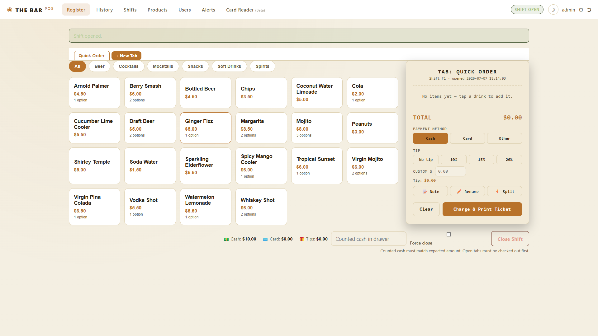
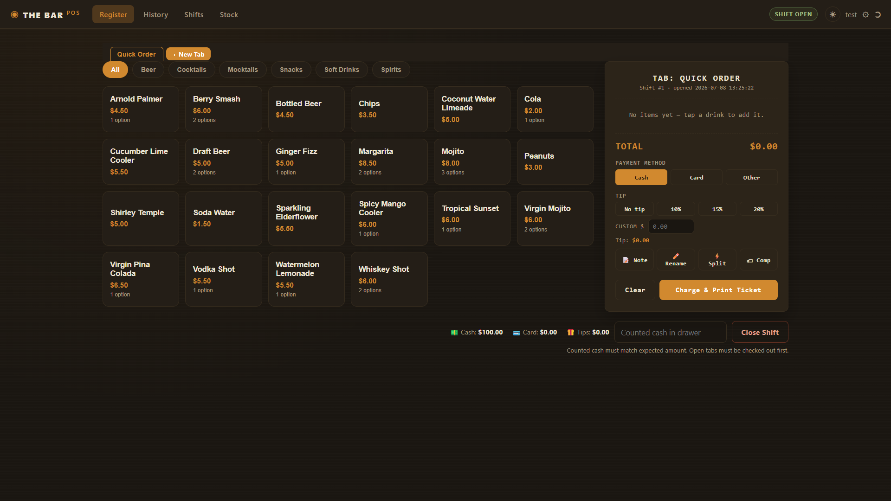

# Home Bar POS

A self-hosted point-of-sale web app for a home bar.
Runs on any Windows PC, Mac, or Raspberry Pi — staff access it from any phone,
tablet, or laptop on the same WiFi.


<p align="center">
  
</p>

---

## Features

| | |
|---|---|
| 🍺 **Register** | Tap drinks to build a ticket, pick modifiers, add a note |
| 📋 **Open Tabs** | Multiple tabs at once, survive page refresh |
| ⚡ **Split Payment** | Divide a bill across cash, card, and more |
| 💰 **Comp & Discount** | Apply a discount at checkout; recorded per-order |
| 💳 **Card Reader** *(Beta)* | Stripe Terminal (live) and Square Terminal (UI only, charging planned) |
| 🖨️ **Thermal Printer** | ESC/POS network, USB, or browser-print fallback |
| 📊 **Shift Reports** | Sales totals, tips, cash reconciliation |
| 🚨 **Alerts** | Cash discrepancies for admins; stock-request alerts from bartenders |
| 📦 **Stock Requests** | Bartenders send low-stock alerts directly to the admin Alerts panel |
| 🔍 **History Search** | Search order history by drink name or order note |
| 🗑️ **Void Orders** | Admin only, permanent, logged |
| 🛒 **Products** | Categories, modifiers, pricing — full CRUD |
| 👥 **Users** | Admin and staff roles, in-app role toggle, password management |
| 🌙 **Dark / Light theme** | Per-device, remembered automatically |

<p align="center">
  
</p>

---

## Quick start

**Requires Python 3.9+** — download from [python.org](https://www.python.org/downloads/).
On Windows, check **"Add Python to PATH"** on the first install screen.

```bash
# Clone the repo
git clone https://github.com/techsociology/Bar_PointOfSales
cd Bar_PointOfSales

# Install dependencies (once)
pip install -r requirements.txt

# Run
py app.py          # Windows
python app.py      # Mac / Linux
```

Open `http://localhost:5000` in any browser.

> **Windows tip:** double-clicking `app.py` won't work — Windows runs `.py` files
> with a silent background interpreter that closes immediately. Always run from a
> terminal: open CMD or PowerShell in the project folder and type `py app.py`.

**Default login:** `admin` / `admin123` — change this immediately after first login.

On first run the app creates `instance/bar_pos.db` with sample products.

### Change the port

```bash
set PORT=8080 && py app.py      # Windows CMD
$env:PORT=8080; py app.py       # Windows PowerShell
PORT=8080 python app.py         # Mac / Linux
```

---

## Accessing from phones and other devices

1. Find the host computer's local IP:
   - Windows: open CMD → `ipconfig` → look for **IPv4 Address** e.g. `192.168.1.42`
   - Mac/Linux: `ip addr` or `ifconfig`
2. On any device on the same WiFi open `http://192.168.1.42:5000`
3. No app install needed — works in any browser

---

## Thermal Receipt Printer *(optional)*

The app supports ESC/POS thermal printers (the kind used in bars and cafés).
`python-escpos` is an optional dependency — if it's not installed, a
**Print (Browser)** fallback is always available from the order detail page.

```bash
pip install python-escpos
```

Then go to **Admin → Receipt Printer** to configure:

- **Network** — printer connected over WiFi/Ethernet (enter IP and port, default 9100)
- **USB (auto)** — printer on `/dev/usb/lp0` (Linux/Mac plug-and-play)
- **USB (manual)** — enter vendor and product ID in hex (e.g. `04b8` / `0202` for Epson)

Print buttons appear on the order detail page once a printer type is saved.

---

## Bartender Stock Requests

Staff can flag low stock directly from the **Stock** tab in the navigation.
They enter an item name and an optional note; the request appears immediately
in the admin **Alerts** panel alongside cash-discrepancy alerts.
Admins can mark each request resolved with one click.

---

## Building from source

> Pre-built releases for Windows and Linux are available on the
> [Releases page](../../releases) — you only need this section if you want to
> build the executables yourself.

### Windows

Requires Python 3.9+ installed with "Add to PATH" checked.

Double-click **`build_exe.bat`**. It installs PyInstaller and compiles everything
into `dist\HomeBarPOS\`. Takes 2–4 minutes.

To also produce a **single installer `.exe`** (adds a Desktop shortcut, Start Menu entry,
and appears in Add/Remove Programs):

1. Download NSIS free from [nsis.sourceforge.io](https://nsis.sourceforge.io/Download) and install it
2. Run `build_exe.bat` again — it detects NSIS automatically and produces `HomeBarPOS_Setup.exe`

### Linux (natively)

```bash
# Install Python if not already present
sudo apt install -y python3 python3-pip   # Debian / Ubuntu / Raspberry Pi
sudo dnf install python3                  # Fedora / RHEL

# Build
bash build_linux.sh
```

Output is in `dist/HomeBarPOS/`. To run it:

```bash
chmod +x dist/HomeBarPOS/HomeBarPOS   # first time only
./dist/HomeBarPOS/HomeBarPOS
```

### Linux (from Windows using WSL2)

WSL2 runs a real Linux environment inside Windows — free, built into Windows 10/11.

**Step 1 — Install WSL2** (one-time)

Open PowerShell as Administrator:
```powershell
wsl --install
```
Restart when prompted. Ubuntu is installed by default.

**Step 2 — Open Ubuntu** from the Start Menu. Set a username and password on first launch.

**Step 3 — Install build tools**

```bash
sudo apt update && sudo apt install -y python3 python3-pip python3-venv zip
```

**Step 4 — Clone the project inside WSL**

> Clone into your Linux home directory (`~`), not `/mnt/c/...`. Cloning onto the
> Windows drive from inside WSL causes permission errors (see troubleshooting below).

```bash
cd ~
git clone https://github.com/techsociology/Bar_PointOfSales
cd Bar_PointOfSales
```

**Step 5 — Build**

```bash
bash build_linux.sh
```

**Step 6 — Copy the output back to Windows**

```bash
cp -r dist/HomeBarPOS /mnt/c/Users/YourName/Desktop/HomeBarPOS_Linux
```

> The Linux binary only runs on Linux. The Windows `.exe` only runs on Windows.

#### Troubleshooting: `git clone` inside WSL

If you see either of these:

```
error: chmod on .../.git/config.lock failed: Operation not permitted
fatal: could not set 'core.filemode' to 'false'
```

or

```
remote: Invalid username or token. Password authentication is not supported for Git operations.
```

then:

- **The `chmod`/`filemode` error** happens when cloning onto the Windows drive
  (`/mnt/c/...`) from inside WSL. Clone into your Linux home directory instead
  (`cd ~` first, as in Step 4 above), then copy back to Windows afterward if needed.
- **Don't use `sudo`** for `git clone` — it can leave files owned by `root`,
  causing further permission issues.
- **The auth error** is GitHub no longer accepting account passwords over HTTPS.
  Use a [Personal Access Token](https://github.com/settings/tokens) instead
  (paste it in place of the password), or set up
  [SSH](https://docs.github.com/en/authentication/connecting-to-github-with-ssh)
  and clone with `git clone git@github.com:techsociology/Bar_PointOfSales.git`.

---

## Card Reader *(Beta)*

> ⚠️ **Not tested with a physical card reader device.**
> The Stripe Terminal integration has been developed and tested using Stripe's
> simulated reader only. Behaviour with real hardware may differ.
> Use in a real payment environment at your own risk.

When a reader is configured, tapping **Card** on the register automatically
sends the charge to the reader — no manual card entry needed.

### Stripe Terminal

Stripe Terminal charging is implemented and has been tested against a simulated
Stripe Terminal reader.

1. Create a free account at [stripe.com](https://stripe.com)
2. Go to **Developers → API keys** → copy your secret key (`sk_test_...` for
   testing, `sk_live_...` for real payments)
3. In the POS: **Admin → Card Reader (Beta)** → select Stripe Terminal → paste
   the key and your Reader ID (`tmr_...`) → Save
4. The Card button on the register shows 💳 when a reader is active — tap
   **Card** → **Charge** to send the charge to the physical reader

> **No physical reader yet?** Stripe supports a simulated reader for testing —
> see [Stripe's Terminal quickstart](https://stripe.com/docs/terminal/quickstart).

### Square Terminal

> ⚠️ **Not yet tested** — credential fields are present in
> **Admin → Card Reader (Beta)**, but the charging flow has not been verified
> against a real or sandbox Square Terminal device. Treat as unverified.

1. Sign up at [developer.squareup.com](https://developer.squareup.com)
2. Create an application → copy the **Sandbox Access Token** for testing
3. In the POS: **Admin → Card Reader (Beta)** → select Square Terminal → paste
   the token and Device ID → Save

---

## Data and backups

All data is stored in `instance/bar_pos.db` (SQLite).

- **Backup:** copy `bar_pos.db` anywhere safe
- **Restore:** replace the file and restart the app
- **Reset:** delete the file — a fresh database is created on next startup

> `instance/` is excluded from git by `.gitignore`.
> It contains your database and your saved Stripe API key — never commit it.

---

## Project structure

```
app.py                    Flask routes and business logic
database.py               SQLite schema and helper functions
launcher.py               Entry point for the compiled executable
build_exe.bat             Build a standalone Windows executable
build_linux.sh            Build a standalone Linux executable
HomeBarPOS.spec           PyInstaller configuration
HomeBarPOS_installer.nsi  NSIS script — packages dist\ into a single Setup.exe
requirements.txt          Python dependencies
static/
  app.js                  Register UI (vanilla JS)
  style.css               All styles (dark and light theme)
templates/                Jinja2 HTML templates
  receipt_printer.html    Admin: thermal printer settings
  staff_alerts.html       Staff: stock request form and history
instance/                 Auto-created on first run (excluded from git)
  bar_pos.db              SQLite database — all your data lives here
  secret.txt              Flask session key — auto-generated, never share
```

---

## Acknowledgements

Built with and thanks to these open-source projects:

- Built with assistance from [Claude](https://claude.ai) (Anthropic AI) ❤️
- [Flask](https://flask.palletsprojects.com/) — web framework
- [Werkzeug](https://werkzeug.palletsprojects.com/) — WSGI utilities
- [Flask-WTF](https://flask-wtf.readthedocs.io/) — CSRF protection
- [waitress](https://docs.pylonsproject.org/projects/waitress/) — production WSGI server for packaged builds
- [python-escpos](https://python-escpos.readthedocs.io/) — optional ESC/POS thermal printer support
- [Stripe](https://stripe.com/docs/terminal) — Stripe Terminal SDK for card reader integration
- [PyInstaller](https://pyinstaller.org/) — packaging into standalone Windows/Linux executables
- [NSIS](https://nsis.sourceforge.io/) — building the Windows installer

Thanks as well to everyone who files issues, tests the Card Reader beta, and
contributes fixes and features — see [CONTRIBUTING.md](CONTRIBUTING.md) to get involved.

---

## License

MIT — see [LICENSE](LICENSE).
